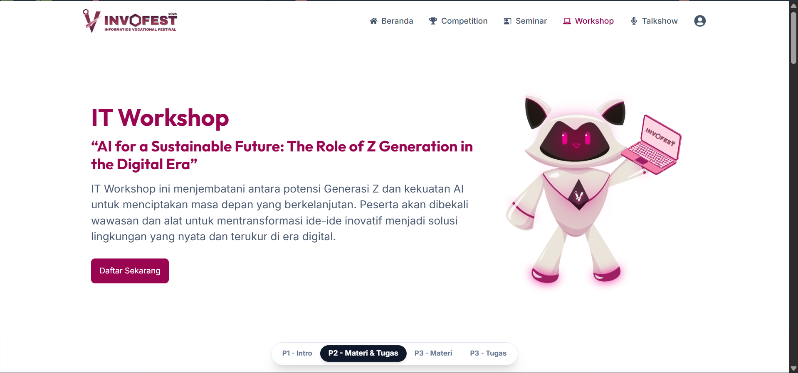
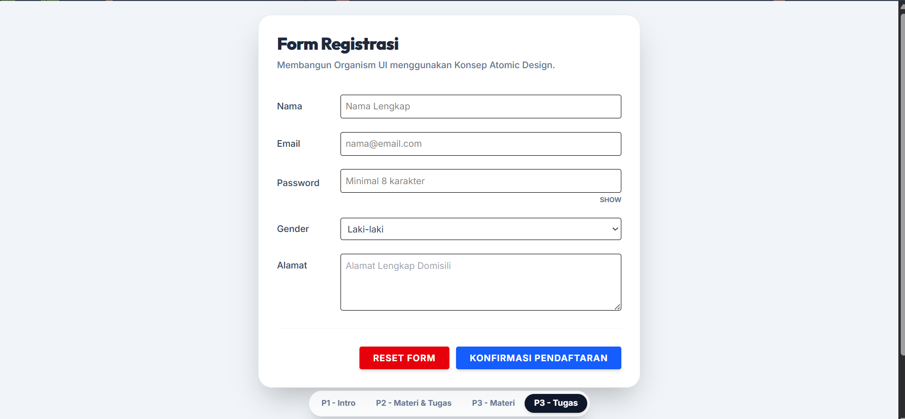
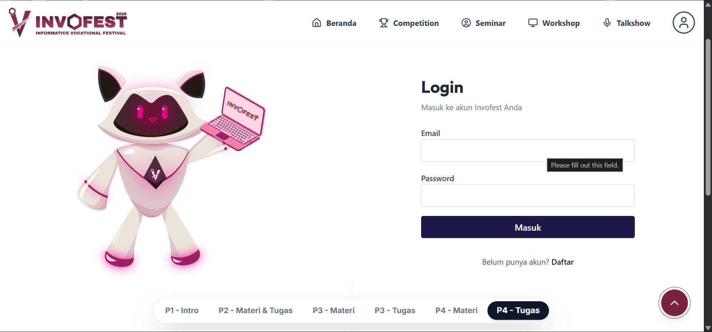

# Project Pemrograman Web 2 - React & TypeScript

Repo ini berisi kumpulan latihan dari Sesi Pertemuan

## Preview Tugas

### Pertemuan 2: IT Workshop (Landing Page)

### Pertemuan 3: Form Registrasi (Atomic Design)

### Pertemuan 4: Invofest Clone Frontend

## Daftar Isi
- **Pertemuan 1**: Dasar-dasar TypeScript.
- **Pertemuan 2**: Latihan membuat Landing Page Workshop menggunakan React.
- **Pertemuan 3**: Latihan validasi form dengan Zod dan struktur komponen Atomic Design.
- **Pertemuan 4**: Pembangunan UI/UX Clone Invofest multi-halaman yang konsisten dengan sistem komponen dinamis, animasi berstruktur (AOS), dan tata letak modern.

## Cara Inisialisasi
1. Pastikan sudah install Node.js.
2. Jalankan `npm install`.
3. Jalankan `npm run dev` untuk melihat hasilnya di browser.
