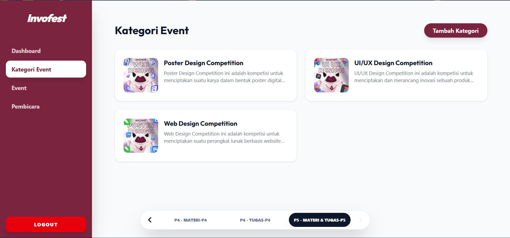

# Invofest Fullstack - React & Express

Repo ini berisi kumpulan pertemuan Pemrograman Web 2

## Struktur Folder
- **`/frontend`**: React + TypeScript + Tailwind CSS
- **`/backend`**: Express + TypeScript

## Preview Tugas (Frontend)

### Pertemuan 1: Pengenalan TypeScript
Mempelajari dasar-dasar Static Typing, Interface, dan Konfigurasi TypeScript untuk membangun fondasi aplikasi yang aman.

### Pertemuan 2: IT Workshop (Invofest UI)

### Pertemuan 3: Form Registrasi (Atomic Design)

### Pertemuan 4: Dynamic SPA Routing (Invofest Multi-page)

### Pertemuan 5: Dashboard Admin (CMS Latihan)

## Cara Inisialisasi
1. Pastikan sudah install Node.js.
2. Jalankan `npm install` di root folder.
3. Jalankan `npm run dev` untuk menjalankan **Frontend** dan **Backend** secara bersamaan.

## Script Perintah (Root)
- `npm run dev`: Menjalankan server frontend (Vite) dan backend (Express) secara paralel.
- `npm run frontend`: Hanya menjalankan frontend.
- `npm run backend`: Hanya menjalankan backend.
