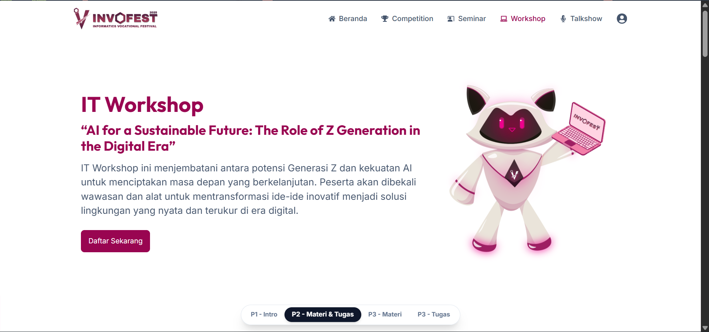
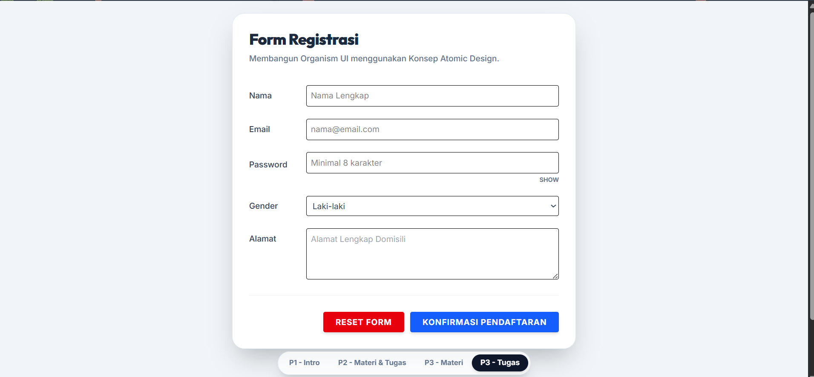
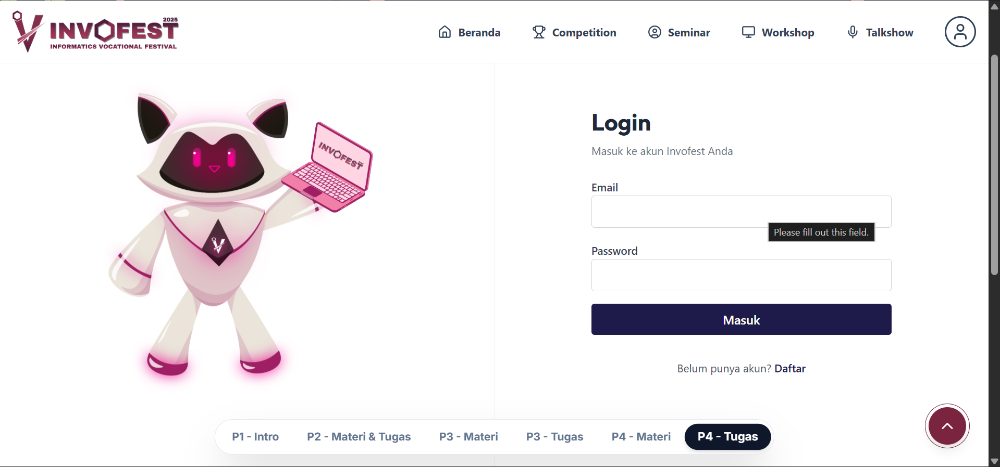

# Project Pemrograman Web 2 - React & TypeScript

Repo ini berisi kumpulan latihan dari Sesi Pertemuan dengan fokus pada pembangunan aplikasi web modern menggunakan React, TypeScript, dan Tailwind CSS.

## Fitur Utama Navigasi
Aplikasi ini menggunakan sistem **Dynamic SPA Routing** dengan bar navigasi floating yang memungkinkan perpindahan antar pertemuan secara instan tanpa reload halaman.

## Preview Tugas

### Pertemuan 2: IT Workshop (Landing Page)

### Pertemuan 3: Form Registrasi (Atomic Design)

### Pertemuan 4: Invofest Clone Frontend

### Pertemuan 5: Dashboard Admin (CMS Latihan)

## Daftar Isi
- **Pertemuan 1**: Dasar-dasar TypeScript & Introduction Screen.
- **Pertemuan 2**: Latihan membuat Landing Page Workshop menggunakan React Props & State.
- **Pertemuan 3**: Latihan validasi form dengan Zod, React Hook Form, dan struktur komponen Atomic Design.
- **Pertemuan 4**: Pembangunan UI/UX Clone Invofest multi-halaman dengan sistem komponen dinamis, animasi berstruktur (AOS), dan navigasi terintegrasi.
- **Pertemuan 5**: Implementasi Dashboard Admin (CMS)
  - Sistem pengelolaan data (State-based) untuk Kategori, Event, dan Pembicara.
  - Rebranding visual menggunakan warna Merah Invofest (`#7B2440`).
  - Sistem otentikasi sederhana dan **Protected Routes**.
  - Layout dashboard minimalis dengan ringkasan data yang dinamis.

## Cara Inisialisasi
1. Pastikan sudah install Node.js.
2. Jalankan `npm install`.
3. Jalankan `npm run dev` untuk melihat hasilnya di browser.
